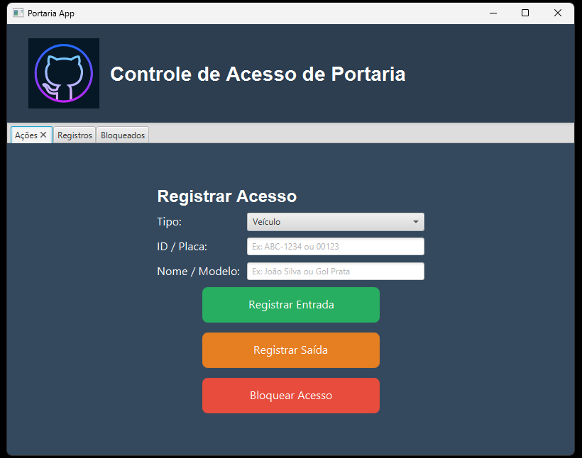

# Projeto Controle de Portaria




### Getting Started


Compilar na pasta src com:
``` 
    javac --module-path ../lib/javafx-sdk-25.0.1/lib \
      --add-modules javafx.controls,javafx.fxml,javafx.base \
      -cp ".;../lib/sqlite-jdbc-3.51.1.0.jar" \
      -d ../bin \
      *.java
```

Rodar na raiz do projeto com:
```
    java --module-path lib/javafx-sdk-25.0.1/lib \
     --add-modules javafx.controls,javafx.fxml,javafx.base \
     -cp ".;lib/sqlite-jdbc-3.51.1.0.jar;bin" \
     ControlePortariaApp
```

---
### Requisitos do projeto:
* Java 25 LTS
* Java FX 25.0.1 LTS
* sqlite-jdbc-3.51.1.0

